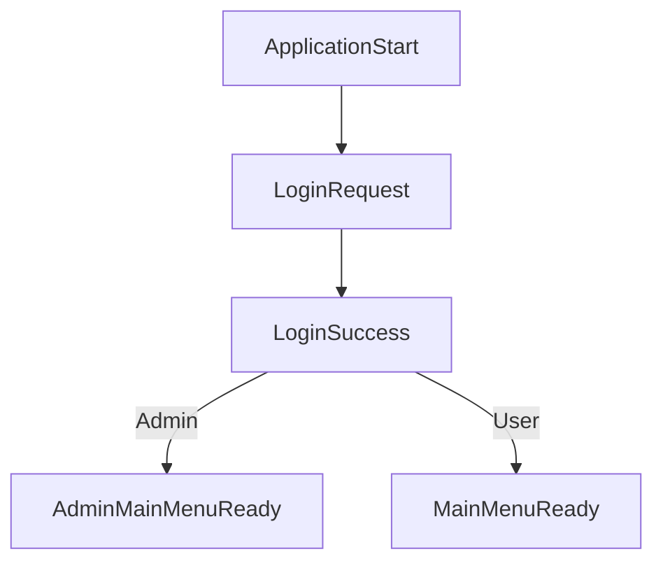

# Example Scenario: Admin vs User Flow

This example extends the Event-Driven App to handle two types of logins:

- **Admin Login** -> Leads to Admin Main Menu
- **Regular User Login** -> Leads to Normal Main Menu

## Flow

## Components Added

- `AdminLoginHandler` - Listens for `LoginSuccess` and branches logic.
- `AdminMainMenuViewRenderer` - Renders admin-specific main menu.

---

## How to Integrate

1. Copy the new files into your project.
2. Instantiate `AdminLoginHandler` and `AdminMainMenuViewRenderer` during startup.
3. Run the app, login as "admin" to see the admin menu!