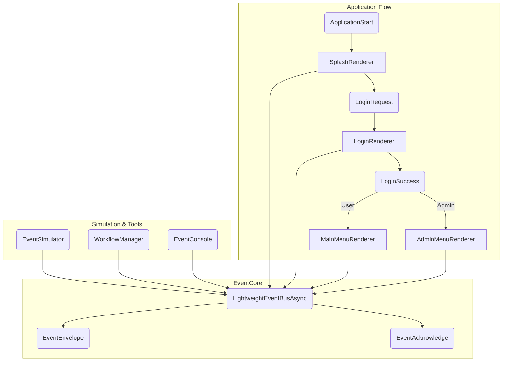

# Event-Driven Application Core - Full Architecture

```mermaid
flowchart TD
    subgraph Application Flow
        StartEvent(ApplicationStart) --> SplashRenderer
        SplashRenderer --> LoginRequestEvent(LoginRequest)
        LoginRequestEvent --> LoginRenderer
        LoginRenderer --> LoginSuccessEvent(LoginSuccess)
        LoginSuccessEvent -->|User| MainMenuRenderer
        LoginSuccessEvent -->|Admin| AdminMenuRenderer
    end

    subgraph EventCore
        EventBus(LightweightEventBusAsync)
        Envelope(EventEnvelope)
        Acknowledge(EventAcknowledge)
    end

    subgraph Simulation & Tools
        Simulator(EventSimulator)
        Workflow(WorkflowManager)
        Console(EventConsole)
    end

    EventBus --> Envelope
    EventBus --> Acknowledge

    Simulator --> EventBus
    Workflow --> EventBus
    Console --> EventBus

    SplashRenderer --> EventBus
    LoginRenderer --> EventBus
    MainMenuRenderer --> EventBus
    AdminMenuRenderer --> EventBus
```